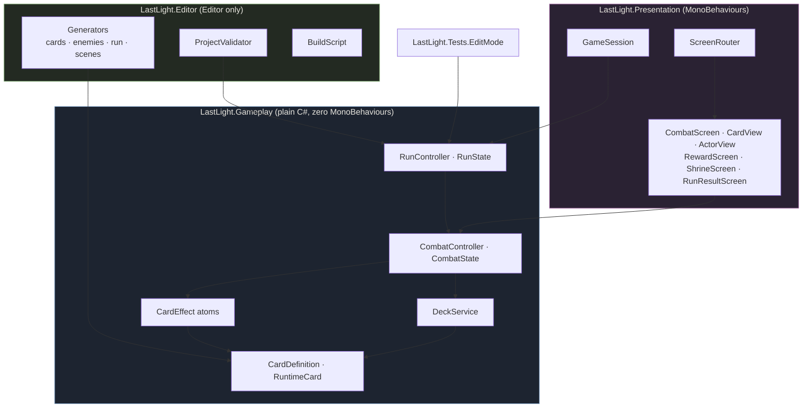
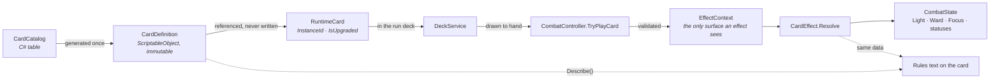
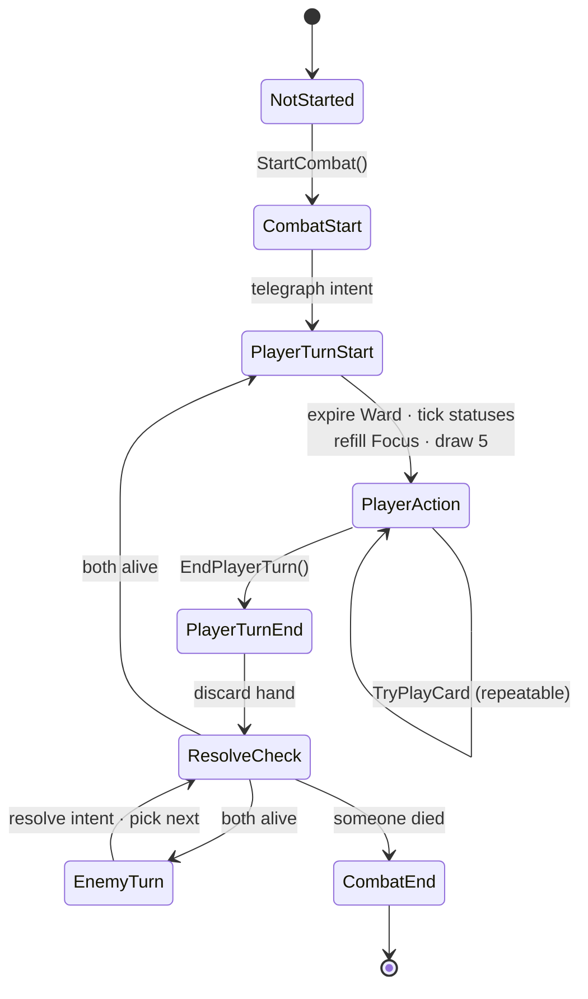
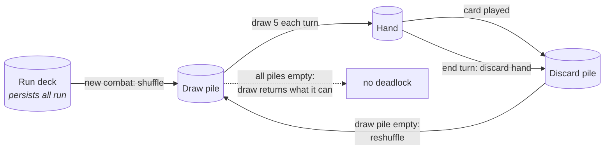
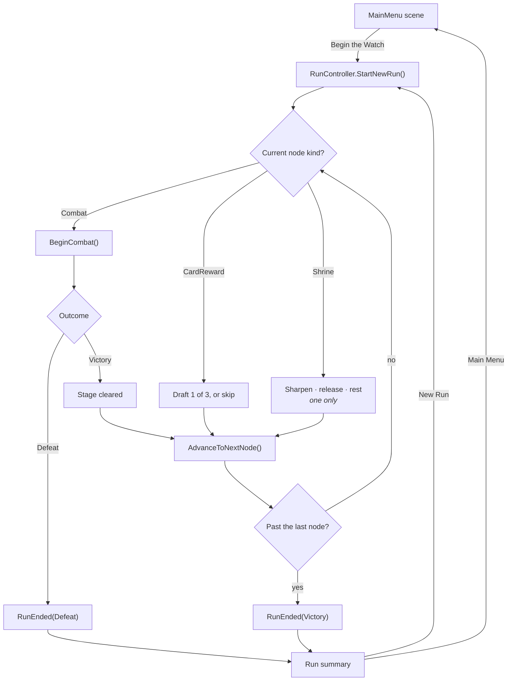

# Architecture

Diagrams are Mermaid, which GitHub renders inline — no image files to fall out of date.

## Layers

The one-way dependency is enforced by assembly definitions, not convention. The gameplay assembly
cannot reference the presentation assembly even by accident, which is what keeps the rules testable
with no scene loaded.

## Card definition to resolution

The path a card takes from authored data to an applied effect. Note that the definition asset is
only ever read.

The dotted path is why printed text cannot drift from behaviour: both come from the same effects.

## Turn flow

`PlayerAction` is the only phase in which a card can be played. Every other phase passes through in
a single synchronous step.

A card that kills the enemy mid-turn ends the combat immediately — `TryPlayCard` re-checks the
outcome after resolving, so the phase moves to `CombatEnd` without waiting for the turn to end.

## Deck lifecycle

A played card leaves the hand *before* it resolves and enters the discard *after*, so a card that
draws cards can never redraw itself mid-resolution.

## Run flow

Both ways a run can end funnel through `RunEnded`, so neither needs a special case in the session.
Winning is *running off the end of the node list* rather than a flag set by the last fight.

## Where state lives

| State | Owner | Lifetime |
|---|---|---|
| Card rules, costs, effects | `CardDefinition` asset | forever, read-only |
| Which copy is upgraded | `RuntimeCard` | one run |
| Light, run deck, node cursor, summary | `RunState` | one run |
| Draw / hand / discard | `DeckService` | one combat |
| Phase, turn, Focus, Ward, statuses | `CombatState` | one combat |
| Anything on screen | views | one frame — always re-read |

The rule that keeps this honest: **the run owns the truth and combat borrows it.** A combat is built
over the run's card list and copies Light back at exactly one point, when it ends.
