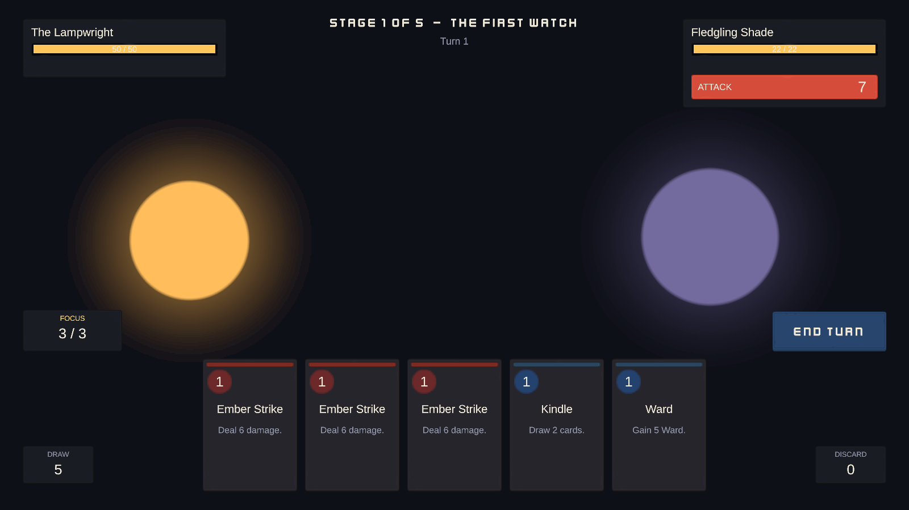
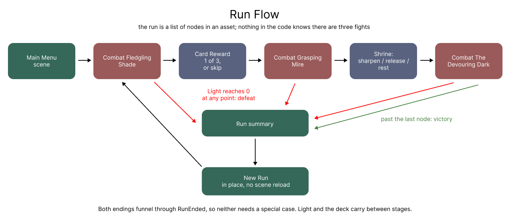
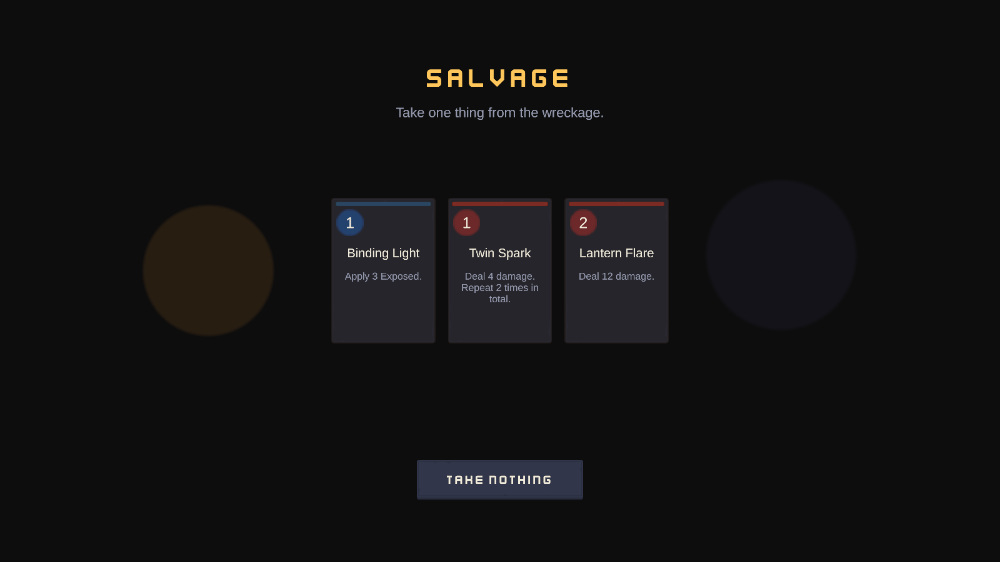
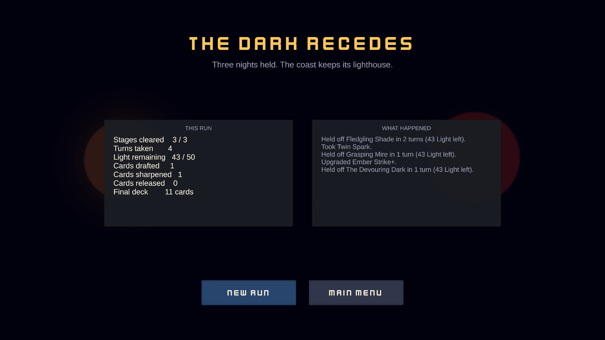
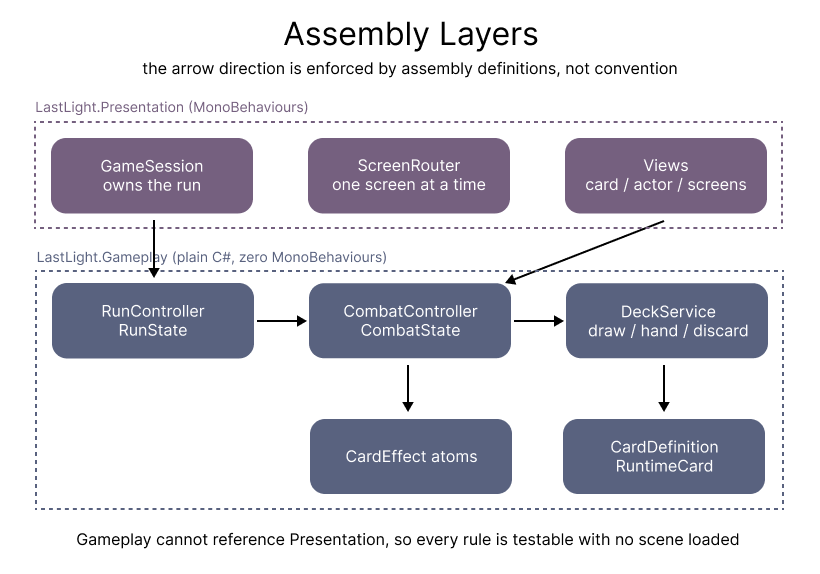
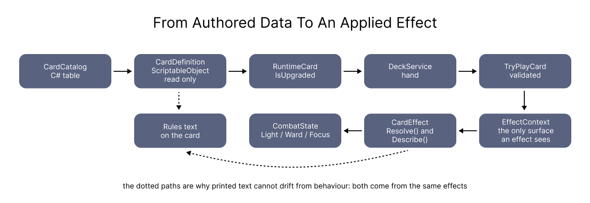
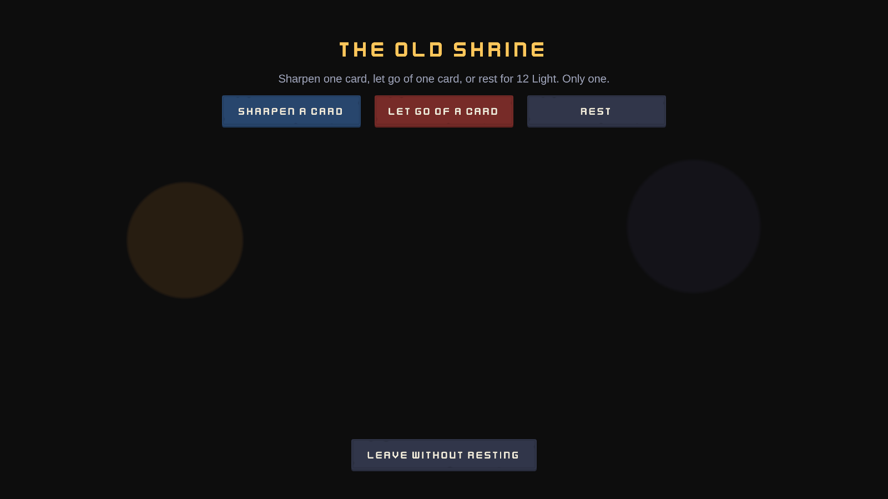
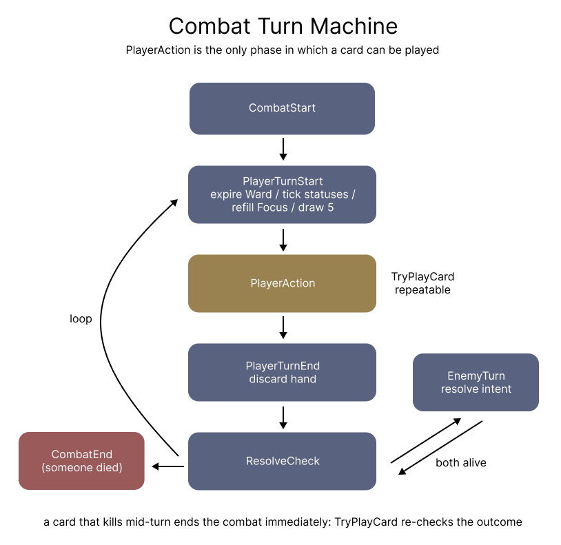
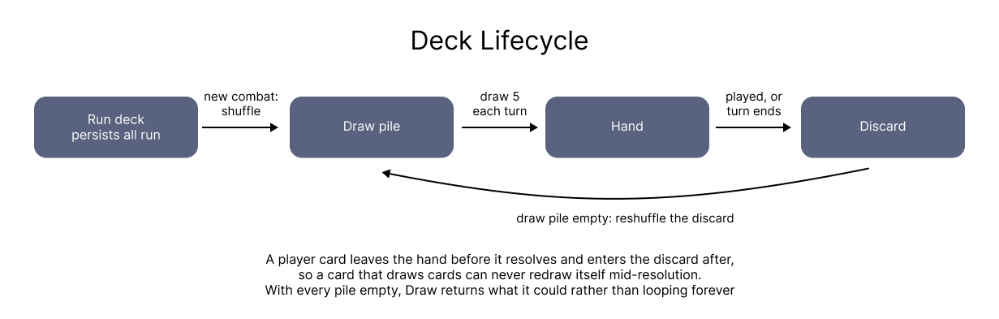

# Last Light

## Game Overview

**Last Light** is a single player 2D turn based deckbuilder. You play the last Lampwright. The Dark
has swallowed the coast, your lantern is the only thing still burning, and you have to hold it for
three nights.

Everything you do is a card. Each turn you draw five and get three **Focus**, every card costs Focus
to play, and whatever you don't spend is gone when the turn ends. Cards deal damage, grant **Ward**
(temporary shielding that lasts until the start of your next turn), restore **Light**, draw more
cards, or apply one of two statuses: **Kindled**, which adds 1 damage per stack, and **Exposed**,
which makes the target take 50% more.

Those two statuses are the whole reason cards combine into something. Kindled applies to *every
hit*, so it's worth far more on a multi hit card like Twin Spark than on one big swing, and Exposed
multiplies whatever lands next, so spending it before your heaviest attack rather than after is the
difference between a good turn and a wasted one.

Meanwhile the enemy tells you exactly what it's about to do, a full turn ahead, including the
number. That number comes out of the same code that will later take the Light off you, so the
telegraph can't lie. Planning around it is the game.

A run is five stops:

Two things carry between stages, and they're what make this a run rather than three unrelated
fights. Your **Light is your health and nothing restores it between fights**, so winning stage one
badly is a debt you pay in stage three. Your **deck carries too**, so the card you draft after the
first fight is in the deck you take into the second.

**You win** by clearing all three fights. **You lose** the moment your Light hits zero, wherever in
the run that happens. Either way you get a summary of how it went and can start another immediately.

## How to Run

1. Download or clone this repository.
2. Open the `Build/` folder.
3. Run `Last Light.exe`.
4. Windows SmartScreen will warn you the executable is unsigned. Choose *More info*, then
   *Run anyway*.
5. Click **Begin the Watch**. It's mouse only: click a card to play it, click **End Turn** when
   you're done, and hover anything on screen to read the rule behind it.

The game opens in a 1600x900 window, is resizable, and the UI scales to any resolution.

- Engine & version used: **Unity 6000.0.75f1**, C#, Universal Render Pipeline (2D Renderer)
- Build location: **`/Build/Last Light.exe`** (also mirrored as a zip on
  [Google Drive](https://drive.google.com/file/d/1QtuJsvexN4OLc94chDj8g8m1CU4bsnSo/view?usp=sharing))

If you'd rather open the project than the build, open the repository folder with Unity 6000.0.75f1,
then open `Assets/_Project/Scenes/MainMenu.unity` and press Play.

## Technical Decisions

Everything below points at the code that implements it and, where one exists, the test that proves
it. If a claim here isn't backed by something you can open, treat it as marketing.

### The gameplay layer contains no MonoBehaviours

The rules are plain C# classes and presentation is a thin layer sitting on top. That isn't a
convention I promised myself to follow, it's enforced at compile time by five assembly definitions
with a one way dependency graph.

`Assets/_Project/Scripts/Gameplay/LastLight.Gameplay.asmdef` has an empty reference list, so the
rules physically can't reach the UI even if I tried. What I get for that is a rule set I can test
headlessly: 92 EditMode tests run with no scene loaded and without ever entering Play mode.

It also makes the ownership question easy to answer, which matters more than it sounds:

| State | Owner | Lifetime |
|---|---|---|
| Card rules, costs, effects | `CardDefinition` asset | forever, read only |
| Which copy is upgraded | `RuntimeCard` | one run |
| Light, run deck, node cursor, summary | `RunState` | one run |
| Draw, hand, discard | `DeckService` | one combat |
| Phase, turn, Focus, Ward, statuses | `CombatState` | one combat |
| Anything on screen | views | one frame, always re-read |

The rule that keeps that honest: **the run owns the truth and combat borrows it.**

### Cards are data composed from reusable effects, not scripts

The obvious way to build this is one class per card. I didn't, because by the fourth card you can
already see the switch statement forming, and every card after that makes it worse.

Instead `CardDefinition` holds a `[SerializeReference] List<CardEffect>`
(`Assets/_Project/Scripts/Gameplay/Cards/CardDefinition.cs:37`), a polymorphic list of atoms:
`DealDamage`, `GainWard`, `Heal`, `DrawCards`, `GainFocus`, `ApplyStatus`, `Repeat`. Adding a card is
data entry. Adding a new *kind* of behaviour is one new small class, and it touches nothing that
already works. There's no card name switch anywhere in this codebase, which is the main thing I
wanted the architecture to demonstrate.

`RepeatEffect` (`Assets/_Project/Scripts/Gameplay/Effects/RepeatEffect.cs:33`) is the clearest
argument for doing it this way. Repeating is orthogonal to what's being repeated, so composing it
hands multi hit to every atom for free rather than to damage alone. It's also where the card synergy
comes from, because Kindled applies per hit, so "4 damage twice" and "8 damage once" stop being the
same card the moment you buff yourself. `EffectResolutionTests.Repeat_AppliesKindledToEveryHit` pins
that down.

Enemy actions are built from the *same* atoms
(`Assets/_Project/Scripts/Gameplay/Enemies/EnemyAction.cs`). An enemy gaining Ward and a card gaining
Ward run identical code, so there's only ever one implementation I have to get right.

### CardDefinition and RuntimeCard are separate on purpose

Say you own five copies of Ember Strike and you sharpen one of them at a Shrine. If the upgrade
wrote to the card asset, all five would change, and worse, the change would stick to the asset and
follow you into your next run. Inside the Editor it would be written to disk.

So anything that differs between copies has to live somewhere else, and that somewhere is
`RuntimeCard`. `RuntimeCard.Upgrade()`
(`Assets/_Project/Scripts/Gameplay/Cards/RuntimeCard.cs:38`) flips a flag on the instance and never
touches the definition.
`EffectResolutionTests.UpgradingOneCopy_LeavesTheDefinitionAndOtherCopiesAlone` exists purely to
guard that. Card instance ids are handed out by the run
(`Assets/_Project/Scripts/Gameplay/Run/RunState.cs:51`) rather than pulled from a static counter, so
nothing survives between runs or between tests.

### Rules text is generated from the effects

Hand written card text drifts. Somebody bumps a number from 6 to 7, forgets the description, and now
the card lies to the player.

`CardDefinition.BuildDescription()`
(`Assets/_Project/Scripts/Gameplay/Cards/CardDefinition.cs:60`) concatenates
`effect.Describe(isUpgraded)` instead, so the printed text and the behaviour come out of the same
data and changing a number changes the card in the same edit. The enemy's telegraph works the same
way, reading its number straight off the action's own effects
(`Assets/_Project/Scripts/Gameplay/Enemies/EnemyAction.cs:41`).

### One damage pipeline, shared by the hit and the preview

`CombatController.ComputeDamage()`
(`Assets/_Project/Scripts/Gameplay/Combat/CombatController.cs:255`) is the only place modifiers get
applied, and `PreviewIntentValue()` on line 270 calls it too. That's not two calculations I keep in
sync, it's one, which is why the number on the enemy's intent is exactly what you're going to take,
buffs and debuffs included.
`TurnFlowTests.TheTelegraphedNumberIsTheDamageTheEnemyActuallyDeals` predicts the number, ends the
turn, and asserts the Light lost matches.

### The UI asks, the controller decides

`TryPlayCard()` (`Assets/_Project/Scripts/Gameplay/Combat/CombatController.cs:143`) is the single
gate every play goes through, and it returns a *reason* rather than a bool so a refusal can be
explained instead of swallowed. `ValidatePlay()` on line 177 answers the same question without side
effects, and `CombatScreen.CanPlay()`
(`Assets/_Project/Scripts/Presentation/Combat/CombatScreen.cs:185`) greys cards out by calling it, so
the UI can't disagree with the rules it's describing.

A card you can't afford stays clickable on purpose
(`Assets/_Project/Scripts/Presentation/Combat/CardView.cs:91`). My first version set
`interactable = false`, which looked right and quietly broke the thing it was meant to help: Unity
swallows clicks on non interactable buttons, so the controller never heard about it and the refusal
message never appeared. You clicked, nothing happened, and the game looked broken. Now the dimming
is only a hint, the click reaches the controller, and the controller says "Not enough Focus."

No view writes to Light, Ward, Focus or any pile. Views subscribe to events and re-read state.

### An explicit turn machine

The phases are an enum rather than a handful of booleans, because three booleans give you eight
combinations and several of them are nonsense. With an enum, "may the player act right now" is one
comparison and the impossible states can't be expressed at all. `EndPlayerTurn()`
(`Assets/_Project/Scripts/Gameplay/Combat/CombatController.cs:79`) walks the whole cycle
synchronously, raising events as it goes.

Resolving synchronously is a trade I made deliberately. It means the rules can be unit tested
without a scene and an animation bug can never desynchronise the simulation, and it costs me the
enemy's turn landing in a single frame. That cost is in Known Issues.

### Deck lifecycle

`DeckService.Draw()` (`Assets/_Project/Scripts/Gameplay/Deck/DeckService.cs:48`) reshuffles the
discard when the draw pile runs out, and it checks per card rather than per call, so a single draw
of five can cross a reshuffle halfway through. It also stops instead of looping forever when every
pile is empty, which stops being hypothetical the moment a Shrine starts removing cards.

A played card leaves the hand *before* it resolves and enters the discard *after*, so a card that
draws cards can never redraw itself.

### A run is a list of nodes in an asset

`RunConfig` describes the whole run: starting Light, starter deck, reward pool, and the sequence of
stops. Nothing in the code knows there are three fights, it knows there's a list, so reordering the
stages or adding one is an asset edit rather than a code change. Winning follows from the same idea:
there's no "this is the boss" flag, you win by walking off the end of the list.

The run owns the truth and combat borrows it. Each fight builds a fresh `CombatController` over the
run's card list, and `RunController.OnCombatEnded()`
(`Assets/_Project/Scripts/Gameplay/Run/RunController.cs:140`) copies Light back at exactly one point
rather than keeping two numbers in sync. That direction of flow is why a drafted card is simply
*there* in the next stage, with no syncing code anywhere.

Routing is driven by the run controller's own `NodeEntered` event rather than by the session walking
the list itself (`Assets/_Project/Scripts/Presentation/GameSession.cs:99`), so exactly one thing
knows where you are.

`StartNewRun()` (`Assets/_Project/Scripts/Gameplay/Run/RunController.cs:62`) builds a new `RunState`
instead of resetting fields. Resetting means I can forget one, and a forgotten field is a bug that
only shows up in your second run, which is the worst kind. Building a new object makes stale state
impossible by construction rather than by memory. It's an in place reset rather than a scene reload,
because a reload would hide whether the run state is actually owned correctly.

### Content and scenes are generated

Cards and enemies are authored once in a C# catalog
(`Assets/_Project/Editor/Generators/CardCatalog.cs`) and generated into ScriptableObject assets, and
`SceneBuilder` builds the scenes and the card prefab. Three reasons: the whole card set is reviewable
in one diff, a balance pass is a single file edit, and wiring dozens of serialized references by hand
is the most error prone thing in this project. Views expose an editor only `Bind()`, so the generator
assigns references through a compiler checked call rather than by name.

Data generation is **idempotent**, meaning assets whose content already matches are left alone. That
took me two attempts. `[SerializeReference]` mints fresh reference ids whenever a list is replaced,
so my first version rewrote all 19 assets on every run and produced a diff made entirely of noise,
which is worse than useless because real changes hide in it. Each effect now reports a content
signature (`Assets/_Project/Scripts/Gameplay/Effects/CardEffect.cs:53`) and the generator compares
before writing. Scene generation is *not* idempotent, and that one is in Known Issues.

The card reference document is generated from the assets too, so a balance change can't leave the
documentation quietly wrong.

### Randomness is injected and seeded

Nothing calls `UnityEngine.Random`. Every system that needs randomness is handed a `GameRng`
(`Assets/_Project/Scripts/Gameplay/Common/GameRng.cs`), which buys two things: a whole run is
reproducible from a single seed, and every test is deterministic without stubbing anything out.

### Assets, and what is mine

All gameplay code is mine. The only third party content is visual: UI panels, buttons and one display
font by [Kenney](https://kenney.nl), released under **CC0** and therefore public domain. I committed
only the six files actually used rather than the full packs; `Assets/_Project/Art/Kenney/ATTRIBUTION.md`
lists them with their original licences.

The actor discs and their glow are generated procedurally by the scene builder, and the two music
tracks are original, synthesised rather than licensed, so nothing in the audio needs clearing either.

### How this was tested

- **92 EditMode tests**: the rules with no scene. Deck reshuffling and exhaustion, every rejection
  reason, each effect atom, damage clamping, the Kindled and Exposed interactions, the exact phase
  sequence, Light carrying between stages, a new run resetting everything, and the tooltip placement
  arithmetic.
- **23 PlayMode tests**: the real scenes, driven the way a player drives them, clicking actual
  buttons and card views and walking a whole run from fight through draft and shrine to the summary.
  These exist because with a code generated UI the realistic failure is an unassigned reference: a
  break that compiles, passes every unit test, and shows up as a dead button.
- **`ProjectValidator`** (`Assets/_Project/Editor/Validation/ProjectValidator.cs`): editor version,
  build settings, duplicate card ids, cards with no effects, combat nodes with no enemy, missing
  scene components. Tests prove the rules are right; this proves the data is sane, and that's the
  class of bug that survives a green test run.
- **A screenshot fixture** that renders every screen to a PNG. Two purely visual bugs, a health bar
  rendering as a lens and a display font whose `7` reads as a bracket, passed the entire suite and
  were caught only by looking at the images.

### What I deliberately did not build

Multiple enemies per encounter, relics or passive items, save and load, a branching map, sound
effects, localisation, and gamepad input. Each one is a real system, none of them show anything about
the card architecture that it doesn't already show, and the time went into testing instead.

## What I Would Do With More Time

A note on the time first. The brief arrived on 11 August, but 11 to 14 August were committed to a
full time offline internship, so this was built across three days, 15 to 17 August, against a brief
scoped for five to seven. That shaped the ordering more than anything else: every mandatory
requirement was finished on day one, so if I lost a day I'd lose polish rather than requirements.
It's also the honest reason several items below aren't done, rather than a claim they were out of
scope.

Roughly in the order I'd pick them up:

1. **Sequence the presentation of a turn.** Combat resolves instantly and the views re-read state, so
   when the enemy acts the numbers snap into place while only the flourishes animate. The
   architecture is already right for the fix, since the controller emits an event stream, so this is
   a presentation side queue that replays those events with delays and blocks input while it plays.
   It's the single biggest gap between this and something that feels finished.
2. **More enemies and a real encounter table**, so a run isn't the same three fights every time. The
   data model already supports it; it's content plus a weighted picker.
3. **A reward pool weighted by rarity**, plus a "remove a card" reward, so thinning your deck
   competes with growing it as a strategy.
4. **Balance from data.** A headless simulator that plays a few thousand runs with a simple policy
   and reports win rate per stage. The seeded RNG and the MonoBehaviour free rules layer make this
   cheap to write, and it would replace my guesses about the boss ramp with numbers.
5. **Per card artwork.** `CardDefinition` already has an `artwork` field and nothing fills it.
6. **Keyboard support**: number keys to play cards, space to end the turn, and some way to reach the
   hover explanations without a mouse.

## Known Issues

- **Scene generation is not idempotent.** Rebuilding the scenes rewrites `Game.unity` in full,
  roughly 2,700 lines, because Unity assigns fresh local file ids to objects created in a new scene.
  The content is identical and the diff is noise. I keep it off the routine path as its own menu
  item. The *data* generator doesn't have this problem because it compares content signatures first.
- **Turn resolution is not animated.** The enemy's whole turn applies in one frame, so numbers jump
  and only the hit flash and the floating damage number animate.
- **The hand overlaps rather than fans** once it holds more than about seven cards. Still readable,
  but the tighter spacing is a compromise rather than a design.
- **Discarding your hand at the end of a turn surprises people.** It's standard for the genre and the
  cards aren't lost, they go to the discard pile and come back on the next reshuffle, but a first
  time player reads it as their cards vanishing. I know because it caught me during a playtest of my
  own build. It's now stated on the End Turn button and in its tooltip, which is a label rather than
  a real fix; the genuine fix is a short animation of the hand moving to the discard pile, and that
  belongs with the turn sequencing work above.
- **Balance is lightly tuned.** I played the run enough to know it's winnable and losable, not enough
  to call the curve good. The Devouring Dark ramps itself with Kindled, so a slow start against it
  can spiral.
- **Enemy patterns are fixed loops.** Deliberate, since it makes fights learnable and keeps tests
  deterministic, but it does mean a second run against the same enemy holds no surprises.
- **Cards have no individual art**, only colour coding by type.
- **Hover explanations are mouse only.**
- **The screenshot fixture temporarily switches the canvas to camera space** in order to render,
  because overlay canvases bypass cameras and `ScreenCapture` writes nothing in batch mode. It's a
  test only hack and it does mutate scene state while it runs.
- **The EditMode test assembly references the presentation assembly**, purely to reach one pure
  static function for tooltip placement. The tests are still headless and scene free, but it's a
  crack in the "tests only reference gameplay" rule I set myself.

Two more documents are in `Documentation/`: `REQUIREMENTS.md` audits the brief line by line against
what shipped, and `CARD-REFERENCE.md` lists every card and enemy, generated from the assets so it
can't fall out of date.
