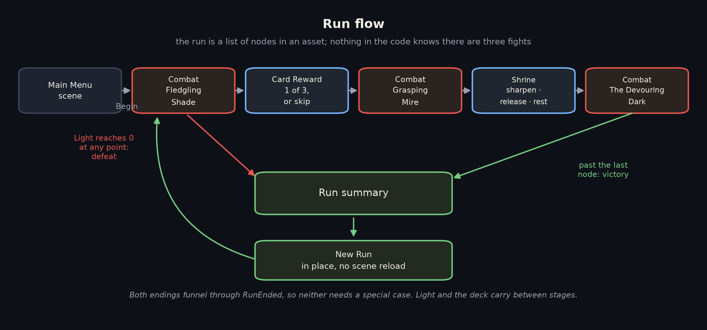
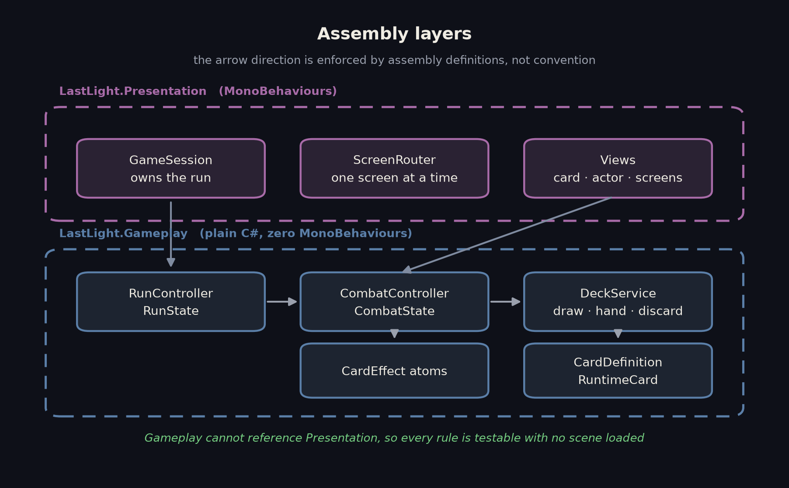
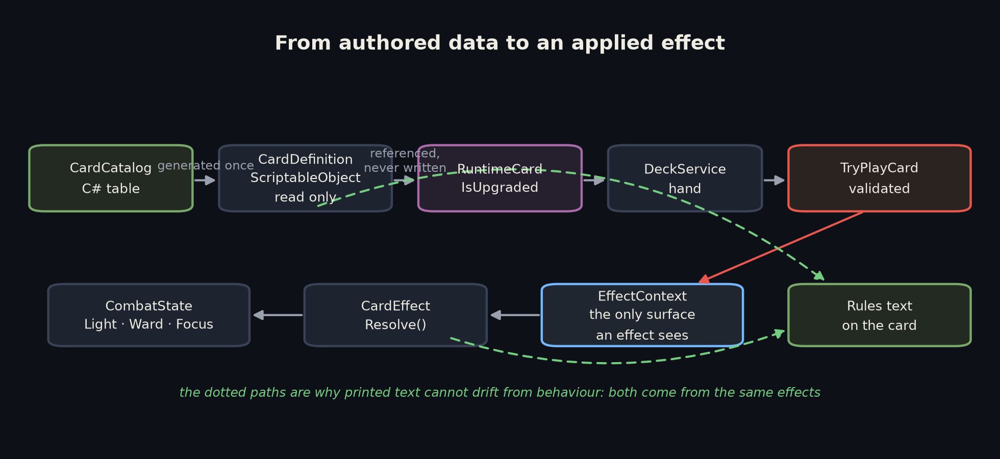
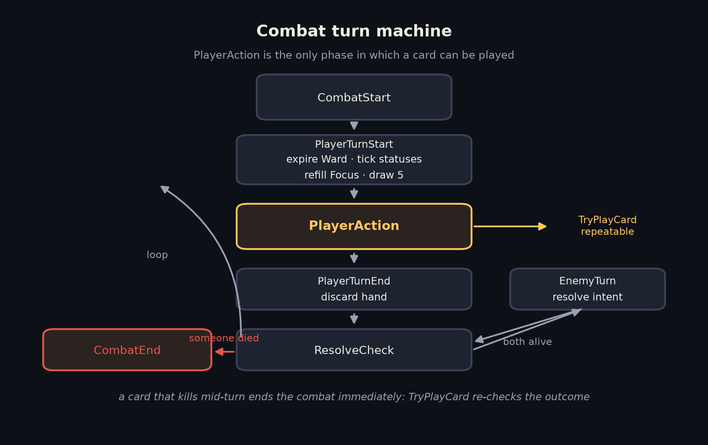
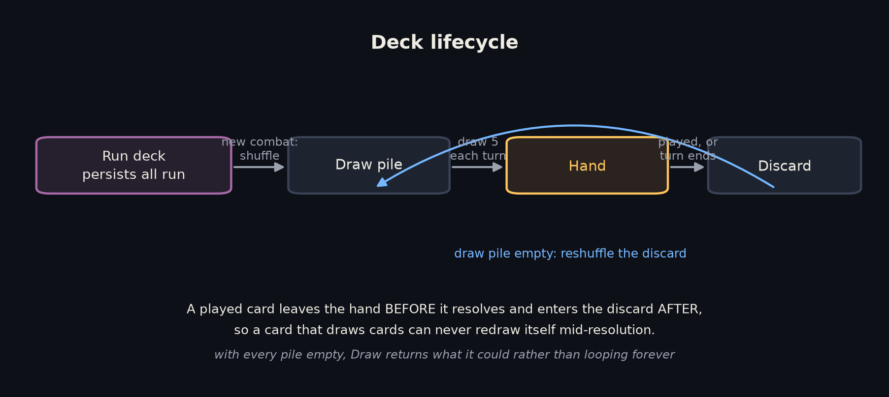

# Last Light

## Game Overview

**Last Light** is a single player 2D turn based deckbuilder. You are the last Lampwright: the Dark
has swallowed the coast and your lantern is the only thing still burning. You have to hold the light
for three nights.

Everything you do is a card. At the start of each turn you draw five cards and receive three
**Focus**. Every card costs Focus to play, and any Focus you do not spend is lost when the turn ends.
Cards deal damage, grant **Ward** (temporary shielding that expires at the start of your next turn),
restore **Light**, draw more cards, or apply one of two statuses: **Kindled** (+1 damage per stack)
and **Exposed** (+50% damage taken).

Those two statuses are what make cards combine. Kindled applies to *every hit*, so it is worth far
more on a multi hit card such as Twin Spark than on one large swing. Exposed multiplies incoming
damage, so applying it before a big attack is worth more than applying it after.

The enemy announces its next move a full turn in advance, including the exact number it will use.
That number is produced by the same code that will later apply the damage, so the telegraph cannot
lie to you. Planning around it is the game.

A run is five stops:

Two things carry between stages, and they are what make it a run rather than three separate fights.
Your **Light is your health and it is not restored between fights**, so winning stage one sloppily
costs you in stage three. Your **deck carries too**, so the card you draft after the first fight is
in the deck you play the second fight with.

**You win** by clearing all three fights. **You lose** the moment your Light reaches zero, at any
point in the run. Either way you get a summary of how the run went and can immediately start
another.

## How to Run

Step by step:

1. Download or clone this repository.
2. Open the `Build/LastLight/` folder.
3. Run `LastLight.exe`.
4. Windows SmartScreen will warn that the executable is unsigned. Choose *More info*, then
   *Run anyway*.
5. Click **Begin the Watch**. Mouse only: click a card to play it, click **End Turn** when you are
   done, and hover anything on screen to read the rule behind it.

The game opens in a 1600x900 window and is resizable. The UI scales to any resolution.

- Engine & version used: **Unity 6000.0.75f1**, C#, Universal Render Pipeline (2D Renderer)
- Build location: **`/Build/LastLight/LastLight.exe`** (also mirrored at
  `TODO: Google Drive link to be added before submission`, a 35 MB zip)

To open the project instead of the build, open the repository folder with Unity 6000.0.75f1, then
open `Assets/_Project/Scenes/MainMenu.unity` and press Play.

## Technical Decisions

Every claim below points at the code that implements it and, where one exists, the test that proves
it.

### The gameplay layer contains no MonoBehaviours

The rules are plain C# classes; presentation is a thin layer on top. This is not a convention, it is
enforced at compile time by four assembly definitions with a one way dependency graph.

`Assets/_Project/Scripts/Gameplay/LastLight.Gameplay.asmdef` does not reference the presentation
assembly, so the rules *cannot* reach the UI even by accident. The payoff is that the whole rule set
is testable headlessly: 91 EditMode tests run with no scene loaded and without entering Play mode.

### Cards are data composed from reusable effects, not scripts

`CardDefinition` holds a `[SerializeReference] List<CardEffect>`
(`Assets/_Project/Scripts/Gameplay/Cards/CardDefinition.cs:38`), a polymorphic list of atoms:
`DealDamage`, `GainWard`, `Heal`, `DrawCards`, `GainFocus`, `ApplyStatus`, `Repeat`. Adding a card is
data entry; adding a new *kind* of behaviour is one new small class. There is no card name switch
anywhere in the codebase, which is the main thing I wanted the architecture to demonstrate.

`RepeatEffect` (`Assets/_Project/Scripts/Gameplay/Effects/RepeatEffect.cs:33`) is the clearest
argument for the approach. Repeating is orthogonal to what is being repeated, so composing it gives
multi hit to every atom for free. It is also where the card synergy comes from, because Kindled
applies per hit. `EffectResolutionTests.Repeat_AppliesKindledToEveryHit` pins that down.

Enemy actions are built from the *same* atoms
(`Assets/_Project/Scripts/Gameplay/Enemies/EnemyAction.cs`). An enemy gaining Ward and a card
gaining Ward run identical code, so there is only ever one implementation to get right.

### CardDefinition and RuntimeCard are separate on purpose

The definition is a ScriptableObject shared by every copy of that card in every run, and it is never
written to. Per copy state, "this particular copy has been sharpened", lives on `RuntimeCard`, and
`RuntimeCard.Upgrade()` (`Assets/_Project/Scripts/Gameplay/Cards/RuntimeCard.cs:38`) flips a flag on
the instance.

Without that split, sharpening a card at a Shrine would mutate the asset on disk and leak into your
next run. `EffectResolutionTests.UpgradingOneCopy_LeavesTheDefinitionAndOtherCopiesAlone` exists
purely to guard it. Card instance ids come from the run
(`Assets/_Project/Scripts/Gameplay/Run/RunState.cs:41`) rather than a static counter, so nothing
survives between runs or between tests.

### Rules text is generated from the effects

`CardDefinition.BuildDescription()`
(`Assets/_Project/Scripts/Gameplay/Cards/CardDefinition.cs:60`) concatenates
`effect.Describe(isUpgraded)`. The text on the card and the behaviour it performs come from the same
data, so they cannot drift apart: changing a number changes the printed card in the same edit. The
same idea drives the enemy's telegraph, whose number is read from the action's own effects
(`Assets/_Project/Scripts/Gameplay/Enemies/EnemyAction.cs:49`).

### One damage pipeline, shared by the hit and the preview

`CombatController.ComputeDamage()`
(`Assets/_Project/Scripts/Gameplay/Combat/CombatController.cs:255`) is the only place modifiers are
applied. `PreviewIntentValue()` on line 270 calls it as well, which is why the number on the enemy's
intent is exactly what you will take, buffs included.
`TurnFlowTests.TheTelegraphedNumberIsTheDamageTheEnemyActuallyDeals` asserts the two agree.

### The UI asks, the controller decides

`TryPlayCard()` (`Assets/_Project/Scripts/Gameplay/Combat/CombatController.cs:143`) is the single
gate every play passes through, and it returns a *reason* rather than a bool, so a refusal can be
explained instead of swallowed. `ValidatePlay()` on line 177 answers the same question without side
effects, and `CombatScreen.CanPlay()`
(`Assets/_Project/Scripts/Presentation/Combat/CombatScreen.cs:185`) greys cards out by calling it.
The UI therefore cannot disagree with the rules it is describing.

An unaffordable card stays clickable on purpose
(`Assets/_Project/Scripts/Presentation/Combat/CardView.cs:78`). Greying out is a hint; the controller
decides. Making the button non interactable would swallow the click, and a card that silently does
nothing teaches the player less than one that says "Not enough Focus."

No view writes to Light, Ward, Focus or any pile. Views subscribe to events and re-read state.

### An explicit turn machine

The phases are an enum rather than a set of booleans, so "may the player act right now" is one
comparison. `EndPlayerTurn()`
(`Assets/_Project/Scripts/Gameplay/Combat/CombatController.cs:79`) walks the whole cycle
synchronously and raises events as it goes.

Resolving synchronously is a deliberate trade. It means the rules can be unit tested without a scene
and an animation bug can never desynchronise the simulation, at the cost of the enemy's turn
applying in a single frame. That cost is listed under Known Issues.

### Deck lifecycle

`DeckService.Draw()` (`Assets/_Project/Scripts/Gameplay/Deck/DeckService.cs:48`) reshuffles the
discard when the draw pile empties, and stops rather than looping forever when every pile is empty,
which is reachable once a Shrine starts removing cards. A played card leaves the hand *before* it
resolves and enters the discard *after*, so a card that draws cards can never redraw itself.

### A run is a list of nodes in an asset

`RunConfig` describes the whole run: starting Light, starter deck, reward pool and the node sequence.
Nothing in the code knows there are three fights; it knows there is a list. Reordering the stages or
adding one is an asset edit.

The run owns the truth and combat borrows it. Each fight builds a fresh `CombatController` over the
run's card list, and `RunController.OnCombatEnded()`
(`Assets/_Project/Scripts/Gameplay/Run/RunController.cs:140`) copies Light back at exactly one point.
That direction of flow is why a drafted card is simply *present* in the next stage with no syncing
code.

Routing is driven by the run controller's own `NodeEntered` event rather than by the session walking
the list (`Assets/_Project/Scripts/Presentation/GameSession.cs:99`), so exactly one thing knows where
you are.

`StartNewRun()` (`Assets/_Project/Scripts/Gameplay/Run/RunController.cs:62`) constructs a new
`RunState` rather than resetting fields, which makes stale state impossible by construction instead
of by remembering to clear everything. It is an in place reset rather than a scene reload, because a
reload would hide whether run state is actually owned correctly.

### Content, scenes and documentation are generated

Cards and enemies are authored once in a C# catalog
(`Assets/_Project/Editor/Generators/CardCatalog.cs`) and generated into ScriptableObject assets. The
scenes and the card prefab are built by `SceneBuilder`. Three reasons: the whole card set is
reviewable in one diff, a balance pass is a single file edit, and wiring dozens of serialized
references by hand is the most error prone part of this project. Views expose an editor only
`Bind()` so the generator assigns references through a compiler checked call rather than by name.

Data generation is **idempotent**: assets whose content already matches are left untouched. That
took a second pass to get right. `[SerializeReference]` mints new reference ids whenever a list is
replaced, so the first version rewrote all 19 assets on every run and produced a diff of pure noise.
Each effect now reports a content signature
(`Assets/_Project/Scripts/Gameplay/Effects/CardEffect.cs:50`) and the generator compares before
writing. Scene generation is *not* idempotent, which is listed under Known Issues.

The card reference document and the diagrams in this README are generated too, from the assets and
from `Tools/diagrams/generate_diagrams.py` respectively, so a balance change cannot leave the
documentation quietly wrong.

### Randomness is injected and seeded

Nothing calls `UnityEngine.Random`. Every system that needs randomness takes a `GameRng`
(`Assets/_Project/Scripts/Gameplay/Common/GameRng.cs`), so a run is reproducible from one seed and
every test is deterministic without stubbing anything out.

### Assets, and what is mine

All gameplay code is my own. The only third party content is visual: UI panels, buttons and one
display font by [Kenney](https://kenney.nl), released under **CC0** (public domain). Only the six
files actually used are committed rather than the full packs; see
`Assets/_Project/Art/Kenney/ATTRIBUTION.md` for the list and the original licences.

The actor discs and their glow are generated procedurally by the scene builder, and the music is
synthesised by `Tools/audio/generate_music.py`, so both are original and reproducible from this
repository.

### How this was tested

- **91 EditMode tests**: the rules with no scene. Deck reshuffling and exhaustion, every rejection
  reason, each effect atom, damage clamping, the Kindled and Exposed interactions, the exact phase
  sequence, Light carrying between stages, a new run resetting everything, and the tooltip placement
  arithmetic.
- **23 PlayMode tests**: the real scenes, driven the way a player drives them, clicking actual
  buttons and card views and walking a whole run from fight through draft and shrine to the summary.
  These exist because with a code generated UI the realistic failure is an unassigned reference, a
  break that compiles, passes every unit test, and shows up as a dead button.
- **`ProjectValidator`** (`Assets/_Project/Editor/Validation/ProjectValidator.cs`): editor version,
  build settings, duplicate card ids, cards with no effects, combat nodes with no enemy, missing
  scene components. The class of bug that survives a green test run.
- **A screenshot fixture** that renders every screen to a PNG. Two purely visual bugs, a health bar
  rendering as a lens and a display font whose `7` reads as a bracket, passed the entire test suite
  and were caught only by looking at the images.

### What I deliberately did not build

Multiple enemies per encounter, relics or passive items, save and load between sessions, a branching
map, sound effects, localisation, and gamepad input. Each is a real system, none of them demonstrate
anything the card architecture does not already show, and the time went into testing instead.

## What I Would Do With More Time

A note on the time available: the brief arrived on 11 August, but 11 to 14 August were committed to
a full time offline internship, so this was built across three days, 15 to 17 August, against a brief
scoped for five to seven. That drove the ordering, every mandatory requirement was finished on day
one, and it is the reason some of the items below are not done rather than a claim that they were
out of scope.

Roughly in the order I would pick them up:

1. **Sequence the presentation of a turn.** Combat resolves instantly and the views re-read state, so
   when the enemy acts the numbers snap while only the flourishes animate. The architecture is
   already right for the fix, since the controller emits an event stream, so this is a presentation
   side queue that replays those events with delays and blocks input while it plays. It is the single
   biggest gap between this and something that feels finished.
2. **Make scene generation idempotent, or stop generating scenes.** Most likely by generating prefabs
   and composing a thin hand authored scene from them, so regenerating touches prefabs whose ids are
   stable.
3. **More enemies and a real encounter table**, so a run is not the same three fights. The data model
   already supports it; it is content plus a weighted picker.
4. **A reward pool weighted by rarity**, plus a "remove a card" reward, so deck thinning competes with
   deck growth as a strategy.
5. **Balance from data.** A headless simulator that plays a few thousand runs with a simple policy and
   reports win rate per stage. The seeded RNG and the MonoBehaviour free rules layer make this cheap
   to write, and it would replace my guesses about the boss ramp with numbers.
6. **Per card artwork.** `CardDefinition` already has an `artwork` field and nothing populates it.
7. **Keyboard support**, number keys to play cards and space to end the turn, and making the hover
   explanations reachable without a mouse.

## Known Issues

- **Scene generation is not idempotent.** Rebuilding the scenes rewrites `Game.unity` in full,
  roughly 2,700 lines, because Unity assigns fresh local file ids to objects created in a new scene.
  The content is identical and the diff is noise. It is kept off the routine path as its own menu
  item. The *data* generator does not have this problem because it compares content signatures first.
- **Turn resolution is not animated.** The enemy's whole turn applies in one frame. Numbers jump, and
  only the hit flash and the floating damage number animate.
- **The hand overlaps rather than fans** once it holds more than about seven cards. Readable, but the
  tighter spacing is a compromise rather than a design.
- **Discarding your hand at the end of a turn surprises people.** It is standard for the genre and
  the cards are not lost, they go to the discard pile and return on the next reshuffle, but a first
  time player reads it as their cards vanishing. It is now stated on the End Turn button and in its
  tooltip, which is a label rather than a real solution; the genuine fix is a short animation of the
  hand moving to the discard pile, which belongs with the turn sequencing work above.
- **Balance is lightly tuned.** I played the run enough to know it is winnable and losable, not enough
  to call the curve good. The Devouring Dark ramps itself with Kindled, so a slow start against it can
  spiral.
- **The music is synthesised, not composed.** It is a deliberate ambient drone and it loops
  seamlessly, but it is two tracks of texture rather than music with any structure, and there are no
  sound effects at all.
- **Enemy patterns are fixed loops.** Deliberate, since it makes fights learnable and keeps tests
  deterministic, but it does mean a second run against the same enemy holds no surprises.
- **Cards have no individual art**, only colour coding by type.
- **Hover explanations are mouse only.**
- **The screenshot fixture temporarily switches the canvas to camera space** in order to render,
  because overlay canvases bypass cameras and `ScreenCapture` writes nothing in batch mode. It is a
  test only hack, and it does mutate scene state while it runs.
- **The EditMode test assembly references the presentation assembly**, purely to reach one pure static
  function (tooltip placement). The tests are still headless and scene free, but it is a crack in the
  "tests only reference gameplay" rule I set myself.

Further detail lives in `Documentation/`: `ARCHITECTURE.md` for the diagrams and where state lives,
`REQUIREMENTS.md` for the brief audited line by line, `QA-CHECKLIST.md` for the manual pass, and
`CARD-REFERENCE.md` for every card and enemy.
